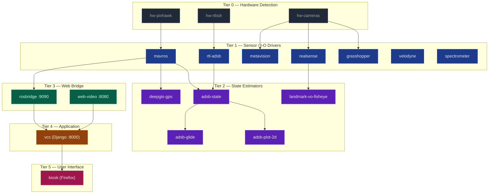

# earth-rover
Affordable and Sustainable Mobility Autonomy for  4D Environmental Monitoring

Jnaneshwar Das, ASU School of Earth and Space Exploration 


## Abstract

For continuous ecological monitoring of urban or suburban environments, it is necessary to have affordable and versatile mobility autonomy. In this setting, we may wish to carry out 3D metric-semantic-topological mapping of trees, infrastructure, rocks, or other features of interest periodically, in intervals of hours to weeks. Autonomous Ground Vehicles (AGVs) from companies such as ClearPath Robotics cost about USD 25000, and need to be carried around for deployment, posing both cost and logistical challenges. 


This prototype is a 26" Schwinn adult tricycle frame, augmented with a front electric motor for traction, a steering system, rear aerodynamic solar panel assembly,  a rear mast for avionics, sensing, and compute payloads. The vehicle's large (26") wheels and low weight (65 kg), enables stability and long range (up to 50 km a day with solar), and is capable of GPS-enabled vision based autonomous navigation on paved or unpaved paths. The vehicle can execute repeatable paths that are either learned by the system from experimental drives by a rider, or through specified or optimized mission plans. At a base cost of about USD 3000, our system is affordable, and can be assembled from either COTS components, or from custom hardware. Additionally, our system can be operated manually like a standard electric tricycle, providing additional modalities for expert data collection and imitation learning. 

## System Description

- **Mass**: 65 kg with instrumentation and solar panels (no human)
- **Range**: Tested 20 km (manual operation, without solar); estimated 30 km with solar over whole day manual operation; estimated 60+ km for autonomous operation with solar
- **Power stores**: Lithium Iron-Phosphate (LiFePO4) 25Ah, 57.6 V (traction); LiFePO4 100Ah, 14.4 V (avionics, compute, sensing, autonomous traction and steering)
- **Power conversion**: 1000W inverter for 14.4V DC to 110V AC; 30A MPPT charge controller for 200W solar charging; 2 x 300W 110V AC to 12V DC power converters for computing and autonomous control; 110V to 58V DC for traction battery charging; 110V to 14.4V DC for avionics/compute battery charging
- **Traction**: Front 1000W (1.3 horsepower) direct-drive 3-phase electric motor; 1000W controller for manual ride controlled by throttle; 300W motor controller for autonomous drives, controlled by Pixhawk flight controller over PWM channel
- **Energy sequestration**: 2 x 100W ultralight panels, mounted on rear boom for aerodynamic shape; regenerative braking
- **Compute**: 11th Gen Intel(R) Core(TM) i7-11800H @ 2.30GHz, 32GB RAM, 512GB internal SSD, 2TB external SSD; Google Coral Tensor Processing Unit (TPU)
- **Avionics**: Pixhawk 2.1 Flight Controller, PX4 open source autopilot software stack; Here+ GPS with RTK option
- **Sensor suite**: PointGrey Grasshopper3 with narrow angle (left) and wide angle (right) lenses; MicaSense Altum 6 band multi-spectral camera triggered by flight controller, 100m LiDARLite LASER ranger; OceanOptics FLAME UV-VIS-NIR spectrometer; Intel RealSense T265 tracking camera
- **Communication**: Ubiquiti networks 2.4GHz AirMax PicoStation access point; WiFi hotspot on onboard compute; 915 MHz telemetry radio to Pixhawk; 2.4GHz DSMX RC transmitter to Pixhawk. Optional SDR (HydraSDR, RTL-SDR) for ADS-B and spectrum monitoring — see [`scripts/hydra_sdr/`](scripts/hydra_sdr/) and [`scripts/rtl_sdr/`](scripts/rtl_sdr/), and the `sdr.launch.py` / `adsb.launch.py` / `rtl_sdr.launch.py` / `rtl_adsb.launch.py` launch files.


## Mobility system

The vehicle has a 1 kW front brushless 3 phase electric motor that operates with a 48V Lithium Iron Phosphate (LiFePO4) battery. The trike can be steered manually or through a slip-drive clutch actuator system. 
The front traction motor is operated at a lower power of 300W with a different controller, for safety. This controller is commanded with a potentiometer-servo combination, providing isolation and an additional level of control since the potentiometer can be rotated like a throttle, by a test rider. 

When controlled manually, a throttle with a hall-effect sensor enables commandeering of the vehicle up to a speed of 12 m/s. Electronic braking serves as an additional source of charging. 

When steered by the Pixhawk flight controller, QGroundControl ground control station (GCS) software is used, and the traction system is switched to a 300W controller for safety, providing lower power and speeds. 

Payload mast: A load bearing mount-point at a height of 120cm from ground, is built using a spring assembly consisting of low-cost COTS carbon fiber and aluminum arrow bodies, and the trike's metal rear basket, that yields to motions in both body frame x, y, and z axes. This assembly helps decouple the mounted imaging and compute system from bumps and jerks that could interfere with data collection, or in the worst case scenario, can damage aspects of the imaging suite assembly. With the mounting assembly, the trike is able to collect data while traversing at speeds up to 12 m/s. 


## Autonomy

The electric tricycle's avionics package consists of a Pixhawk 2.1 flight controller running a rover airframe on the PX4 autopilot software stack. The vehicle is capable of GPS and IMU based waypoint missions, as a base feature, with additional computer vision capabilities through simultaneous localization and mapping 

Figure 2: QGroundControl GCS used for mission planning and situational awareness during a field trial at ASU campus (Dec 2023). 


(SLAM), ORBSLAM3, ROS, PX4, Gazebo, and PX4 SITL digital twin. 

The system's onboard computer runs ROS2, with ros nodes for all the cameras, spectrometer, lidar ranger, and MAVROS package for communicating with the Pixhawk for telemetry, and commanding the vehicle. Instrument drivers for the USB laser ranger and Ocean Optics spectrometer (including live plotting) are kept in [`packages/`](#ros-2-instrument-packages) in this repo. 

QGC allows GPS mission planning, with all operations possible without internet connectivity, on cached maps

## Mapping systems


Figure 3: Realtime mapping demo, while the vehicle is manually operated by a human. The system can leverage the 3D maps and localized vehicle path to plan unmanned operations to remap routes, for instance for biomass change estimation 

Applications and Research Areas  	
Environmental Monitoring in urban and suburban settings, including biomass mapping and heat/shade modeling. 	
With its onboard mapping suite consisting of global shutter multi-focal stereo cameras, a multi-spectral camera, and a UV-VIS-NIR spectrometer, EarthRover is able to collect rich data for 3D environmental analysis. The dense datasets collected by EarthRover (> 1GBps) presents avenues for further research for optimal data fusion for multi-scale, multi-modal hyperspectral datasets, for 4D environmental change monitoring. 
Geological and Ecological Mapping for Digital Twins


Point cloud uncertainty (blue=low)

Figure 4: Mapping of a rocky feature set by the vehicle, by orbiting and collecting imagery with its PointGrey Grasshopper3 camera with narrow angle lens.  

## ADS-B and Visual-Odometry State Estimation

Earth Rover includes an SDR-based ADS-B receiver pipeline (RTL-SDR or HydraSDR fronting `dump1090`) and a coupled state estimator that uses the constellation of decoded aircraft positions to estimate the trike's own receiver location and clock bias. The estimator combines a robust active-set least-squares solver with a Kalman-smoothed receiver state, and can be fused with visual-odometry landmark observations to provide a redundant pose estimate in GNSS-denied or degraded conditions. Real-time visualization is provided by RViz, a 2D top-down plot, a glide-profile plot, and a spherical-fisheye landmark VO plot. Launch entry points: `sdr.launch.py`, `adsb.launch.py`, `adsb_aircraft_state_vectors{,_rviz}.launch.py`, `adsb_state_vectors_plot_2d.launch.py`, `adsb_state_vectors_plot_glide.launch.py`, `landmark_vo_plot_2d.launch.py`, `landmark_vo_plot_fisheye.launch.py`. Internal design notes are kept under `docs/` (untracked — request a copy if you need them).

## Natural Language Interaction and lifelong learning
We anticipate interaction with a human user through command line interface, verbal interaction, and gestures. The command set may include navigational instructions such as "Follow me" which is integrated with the trike autonomy stack for visual tracking of a human leader. For mission planning however, the bulk of the commanding architecture may be natural language with generative AI in the backbone for tokenizing the instructions and generating optimal exploration plans.  

Example natural language prompts: 
Map all trees 
Count fruits along the path I take
Map as much as you can in the next 15 mins, stay within 50m of me. 
Collect imagery at this scene to improve existing maps 
Estimate plant biomass of this patch
What is the rock trait distribution along this pavement? 
Orbit those rocks I am pointing at, with a 10m radius, and show me the 3D model of the rocks.  
 
## Videos

https://drive.google.com/file/d/1M8JIJIpk5DaTXnk8shY55RajGW9rd4tN/view?usp=sharing


https://drive.google.com/file/d/1zt0DhuATs35bWYduTn2sGGhrnV1hIs_N/view?usp=sharing

https://drive.google.com/file/d/1mKV-D2FhJC4ZnpSakJQ_sJLD6O1SGgua/view?usp=sharing


https://www.youtube.com/watch?v=l2MmlcPx6kE


https://www.youtube.com/watch?v=NZj4yiCzRHI


Monitoring normalized difference vegetation index (NDVI) with side-mounted imaging suite with OceanOptics VIS-NIR spectrometer. Imagery from narrow angle and wide angle Grasshopper3 cameras also shown. 
https://youtu.be/PZGcjdSuags?si=71zC8FyeZaOeyud6

Data capture with the vehicle with a Prophesee metavision event camera (Alphacore) in the imaging suite, providing high dynamic range. 
https://www.youtube.com/watch?v=2V3Mc3UAJss

---

## Repository Structure

| Path | Description |
|------|-------------|
| **`src/`** | C++ source for the `deepgis_vehicles` ROS 2 node (`vehicle_interface_node.cpp`) — the MAVROS2 bridge to Pixhawk PX4. |
| **`include/`** | Public headers for the `deepgis_vehicles` C++ node. |
| **`launch/`** | ROS 2 launch files (require the `deepgis_vehicles` package built in your ROS 2 workspace, e.g. `~/ros2_ws`):<br>• Vehicle stack: `vehicle_interface.launch.py`, `earth_rover.launch.py`, `full_system.launch.py`<br>• ADS-B / SDR: `sdr.launch.py`, `adsb.launch.py`, `rtl_sdr.launch.py`, `rtl_adsb.launch.py`, `adsb_aircraft_state_vectors{,_rviz}.launch.py`, `adsb_state_vectors_plot_2d.launch.py`, `adsb_state_vectors_plot_glide.launch.py`<br>• Visual odometry: `landmark_vo_plot_2d.launch.py`, `landmark_vo_plot_fisheye.launch.py`<br>• DeepGIS: `deepgis_telemetry.launch.py` |
| **`scripts/`** | Python nodes and helpers: ADS-B aircraft state-vector publisher, RViz/2D/glide-profile plot nodes, landmark VO plot nodes (2D + spherical fisheye), DeepGIS GPS publisher / rosbag injector / telemetry publisher, recording shell scripts, Pixhawk connection helper. |
| **`scripts/startup/`** | ROS 2 startup scripts (full / minimal trike stack, systemd units, log helpers). See [`scripts/startup/README.md`](scripts/startup/README.md). |
| **`scripts/rtl_sdr/`** | RTL-SDR install + ROS nodes (general SDR + ADS-B 1090 MHz decoder). |
| **`scripts/hydra_sdr/`** | HydraSDR / SoapySDR install + ROS nodes (SDR, ADS-B decoder, spectrum analyzer, visualizer). |
| **`vehicle_control_station/`** | Django web app for real-time camera feeds, GPS/map, LiDAR, spectrometer, avionics gauges, and ROS recording. See [`vehicle_control_station/README.md`](vehicle_control_station/README.md). |
| **`config/`** | YAML and RViz configurations: MAVROS, ADS-B state vectors, landmark VO plots, sensors (RealSense, Grasshopper IDs), DeepGIS telemetry. |
| **`kernelcal/`** | Git submodule — [`darknight-007/kernelcal`](https://github.com/darknight-007/kernelcal): kernel-dynamics / Maximum-Caliber library (companion to the kernel dynamics paper series). Used for spectral analysis and adaptive sampling experiments tied to the rover's environmental monitoring stack. |
| **`Makefile`** | Top-level developer shortcuts (build, source, launch deepgis_vehicles, bring the trike stack up/down, etc.). Run `make help`. |
| **`packages/`** | Colcon-ready ROS 2 add-ons built from this repo (alongside or instead of `~/ros2_ws`): **`laser_ranger`** (USB serial rangefinder) and **`spectrometery_ros2`** (Ocean Optics / SeaBreeze spectrometer publisher, intensity plot + dip markers). See [ROS 2 instrument packages](#ros-2-instrument-packages) below. |

## ROS 2 instrument packages

These packages live under **`packages/`** and use the same ROS 2 distro as the rest of the stack (tested on **Humble**). From the repo root:

```bash
cd ~/earth-rover
source /opt/ros/humble/setup.bash
colcon build --symlink-install --paths packages/laser_ranger packages/spectrometery_ros2
source install/setup.bash
```

### `laser_ranger`

Reads a USB serial laser ranger (default device path is the FTDI by-id used on the trike) and publishes:

- `std_msgs/String` — first whitespace-delimited token (`topic_raw`, default `serial_data`)
- `std_msgs/Float64` — parsed numeric distance when the token is a float (`topic_distance`, default `laser_distance`)

```bash
ros2 run laser_ranger laser_ranger_node
# or
ros2 launch laser_ranger laser_ranger.launch.py serial_device:=/dev/ttyUSB0
```

Python dependency: **`python3-serial`** (`pip install pyserial` if not from apt).

### `spectrometery_ros2`

- **`Spectrometer_Data_Publisher.py`** — SeaBreeze spectrometer → `std_msgs/Float64MultiArray` on `spectrometer` (integration time, intensities, wavelengths). Parameters: `topic`, `integration_time_micros`, `publish_period_sec`.
- **`Intensity_Plot.py`** — subscribes to that topic, publishes a Matplotlib-rendered `sensor_msgs/Image` (`spectrometer_plot` by default), with optional **absorption dip** detection (vertical markers + stats). CLI flags include `--dip-prominence`, `--dip-min-distance`, `--update-rate`, `--dpi`, etc.

**Combined launch** (publisher + plot; matches the usual field command with dip tuning defaults `0.05` / `15`):

```bash
ros2 launch spectrometery_ros2 spectrometer_data_publisher.launch.py
```

Launch arguments:

| Argument | Default | Purpose |
|----------|---------|---------|
| `plot_image` | `true` | Also start `Intensity_Plot.py`; set `false` for hardware publisher only |
| `topic` | `spectrometer` | Spectrum topic for both nodes |
| `integration_time_micros` | `500000` | Exposure |
| `publish_period_sec` | `0.1` | Acquisition period |
| `dip_prominence` | `0.05` | Min dip depth vs spectrum max (passed to `Intensity_Plot`) |
| `dip_min_distance` | `15` | Min index spacing between dips |
| `plot_image_topic` | `spectrometer_plot` | Output image topic |

Dependencies: **`python3-numpy`**, **`python3-matplotlib`**, **`python3-seabreeze`** / SeaBreeze drivers for the spectrometer hardware.

## Mission Launch Sequence

The rover's bring-up is expressed declaratively in
[`scripts/startup/mission.yaml`](scripts/startup/mission.yaml) and compiled to
a graph of `systemd --user` services that bring the stack up in topological
tier order. Every service in the manifest becomes one `er-<id>.service` unit;
the aggregating `er-mission.target` pulls them all up in the correct sequence.

> **Nothing in this graph auto-starts at boot or login.** Auto-enable was
> deliberately removed so every launch is an explicit operator decision
> (due-diligence per launch). Bring the stack up manually via `make
> mission-up`, individual `systemctl --user start er-<unit>.service`
> commands, or the Django mission console.



The same dependency graph is rendered live (with running / starting / failed /
stopped state for every unit, refreshed every 3 s) by the VCS at
**[http://localhost:8000/mission/](http://localhost:8000/mission/)**, sourced
from `systemctl --user show er-*.service`.

Install the unit files (no auto-enable; the install script only writes
`~/.config/systemd/user/er-*.service`):

```bash
cd scripts/startup
./install_user_units.sh
loginctl enable-linger $USER     # keep manually-started services alive across logout
```

Then bring the stack up by hand. The typical flow is to start the web
frontend first so the Django mission console at `http://localhost:8000/mission/`
can act as a per-service launch panel:

```bash
make ui-up           # rosbridge + web_video + vcs + kiosk
# decide what to run today, then either:
systemctl --user start er-mavros.service          # one at a time, or
make mission-up                                   # the whole graph

make mission-status  # one-line state for every er-* unit
make mission-down    # everything off
```

If you ever want the boot-time / graphical-login auto-start back, see
[`scripts/startup/README.md`](scripts/startup/README.md#re-enable-auto-start-only-if-you-really-want-the-old-behavior-back).

See [`scripts/startup/README.md`](scripts/startup/README.md) for the full
walkthrough, customization, and troubleshooting.

## Documentation

Top-level docs tracked in this repo:

- [`CONNECTION_GUIDE.md`](CONNECTION_GUIDE.md) — Connecting to Pixhawk via MAVROS2 (serial-by-id, USB, ACM, SITL).
- [`DEEPGIS_TELEMETRY_README.md`](DEEPGIS_TELEMETRY_README.md) — DeepGIS telemetry publisher (continuous geospatial uplink from the rover).
- [`QUICK_START_TELEMETRY.md`](QUICK_START_TELEMETRY.md) — Quick-start guide for the DeepGIS telemetry stack.
- [`API_COMPLIANCE_CHANGES.md`](API_COMPLIANCE_CHANGES.md) — DeepGIS API compliance change log.
- [`scripts/startup/README.md`](scripts/startup/README.md) — Mission launch dependency chart, systemd `--user` units, kiosk autostart.
- [`scripts/startup/mission.yaml`](scripts/startup/mission.yaml) — Declarative mission topology consumed by both the unit installer and the live VCS mission page.
- [`vehicle_control_station/README.md`](vehicle_control_station/README.md) — Web-based vehicle control station.

ADS-B receiver-position estimation, landmark visual odometry plotting, and state-estimation analyses are kept as design notes under `docs/` (intentionally untracked in version control).

## Cloning

This repo uses a git submodule (`kernelcal`). Clone with `--recurse-submodules`:

```bash
git clone --recurse-submodules git@github.com:Earth-Innovation-Hub/earth-rover.git
```

If you already cloned without `--recurse-submodules`:

```bash
cd earth-rover
git submodule update --init --recursive
```

To later pull updates (including submodule bumps):

```bash
git pull --recurse-submodules
```

---

# deepgis_vehicles ROS2 Package

ROS2 package for connecting with Pixhawk PX4 autopilot using MAVROS2. Launch files for the Earth Rover stack (vehicle interface, full system, SDR, ADS-B) live in this repository under **launch/**; they expect the `deepgis_vehicles` package to be built in your ROS 2 workspace (e.g. `~/ros2_ws`).

## Overview

This package provides a ROS2 interface to communicate with Pixhawk PX4 flight controllers via MAVROS2. It includes:

- **vehicle_interface_node**: A C++ node that interfaces with MAVROS2 to:
  - Subscribe to vehicle state, position, and sensor data
  - Publish commands (position setpoints, velocity commands)
  - Provide services for arming/disarming and mode changes
  - Publish processed vehicle data as standard ROS2 topics

## Dependencies

- ROS2 (Humble/Iron/Rolling)
- MAVROS2 (`mavros`, `mavros_msgs`, `mavros_extras`)
- Standard ROS2 packages: `rclcpp`, `geometry_msgs`, `sensor_msgs`, `nav_msgs`, `std_msgs`
- TF2 for coordinate transformations

## Installation

### Install MAVROS2

Before building this package, you need to install MAVROS2:

**For ROS2 Humble (Ubuntu 22.04):**
```bash
sudo apt update
sudo apt install ros-humble-mavros ros-humble-mavros-extras ros-humble-mavros-msgs
```

**For ROS2 Iron (Ubuntu 22.04):**
```bash
sudo apt update
sudo apt install ros-iron-mavros ros-iron-mavros-extras ros-iron-mavros-msgs
```

**For ROS2 Rolling (Ubuntu 22.04/24.04):**
```bash
sudo apt update
sudo apt install ros-rolling-mavros ros-rolling-mavros-extras ros-rolling-mavros-msgs
```

**Note:** If MAVROS2 packages are not available via apt, you may need to build them from source. See the [MAVROS2 GitHub repository](https://github.com/mavlink/mavros) for instructions.

### Install GeographicLib datasets (required for MAVROS2)

MAVROS2 requires GeographicLib datasets for coordinate transformations:

```bash
sudo geographiclib-get-geoids egm96-5
```

## Building

```bash
cd ~/ros2_ws
colcon build --packages-select deepgis_vehicles
source install/setup.bash
```

## Usage

### Launch with PX4 SITL (Software In The Loop)

For testing with PX4 SITL:

```bash
ros2 launch deepgis_vehicles vehicle_interface.launch.py \
    fcu_url:="udp://:14540@127.0.0.1:14557"
```

### Launch with Physical Pixhawk

**Recommended: Using serial-by-id (stable device identification)**

First, find your Pixhawk device:
```bash
ls -la /dev/serial/by-id/
```

Then launch with the serial-by-id path (recommended for stability):
```bash
ros2 launch deepgis_vehicles vehicle_interface.launch.py \
    fcu_url:="/dev/serial/by-id/usb-3D_Robotics_PX4_FMU_v2.x_0-if00:57600"
```

**Alternative: Using direct device paths**

For a Pixhawk connected via USB:
```bash
ros2 launch deepgis_vehicles vehicle_interface.launch.py \
    fcu_url:="/dev/ttyUSB0:57600"
```

For a Pixhawk connected via ACM:
```bash
ros2 launch deepgis_vehicles vehicle_interface.launch.py \
    fcu_url:="/dev/ttyACM0:57600"
```

**Note:** The serial-by-id method (`/dev/serial/by-id/...`) is recommended because it provides a stable path that doesn't change when the device is plugged into different USB ports.

### Launch Parameters

- `fcu_url`: Connection URL to the flight controller
  - SITL: `udp://:14540@127.0.0.1:14557`
  - Serial-by-id (recommended): `/dev/serial/by-id/usb-3D_Robotics_PX4_FMU_v2.x_0-if00:57600`
  - USB: `/dev/ttyUSB0:57600`
  - ACM: `/dev/ttyACM0:57600`
  - TCP: `tcp://127.0.0.1:5760`
  
  **Baud rates:** Common baud rates for Pixhawk are 57600 (default), 921600 (high-speed), or 115200
- `gcs_url`: Ground Control Station URL (default: `udp://@127.0.0.1:14550`)
- `tgt_system`: Target system ID (default: `1`)
- `tgt_component`: Target component ID (default: `1`)
- `mavros_namespace`: MAVROS namespace (default: `/mavros`)

## Topics

### Subscribed (from MAVROS2)

- `/mavros/state` - Vehicle state (armed, mode, connected)
- `/mavros/local_position/pose` - Local position estimate
- `/mavros/global_position/global` - Global GPS position

### Published (to MAVROS2)

- `/mavros/setpoint_position/local` - Position setpoint commands
- `/mavros/setpoint_velocity/cmd_vel` - Velocity commands
- `/mavros/setpoint_raw/local` - Raw position target

### Published (processed data)

- `vehicle/odometry` - Vehicle odometry (nav_msgs/Odometry)
- `vehicle/connected` - Connection status (std_msgs/Bool)

## Services

The node provides access to MAVROS2 services:

- `/mavros/cmd/arming` - Arm/disarm the vehicle
- `/mavros/set_mode` - Change flight mode

## Example: Arming and Taking Off

```bash
# In one terminal, launch the interface
ros2 launch deepgis_vehicles vehicle_interface.launch.py

# In another terminal, arm the vehicle
ros2 service call /mavros/cmd/arming mavros_msgs/srv/CommandBool "{value: true}"

# Set to OFFBOARD mode
ros2 service call /mavros/set_mode mavros_msgs/srv/SetMode \
    "{custom_mode: 'OFFBOARD'}"

# Publish position setpoint (example: 5m altitude)
ros2 topic pub /mavros/setpoint_position/local geometry_msgs/msg/PoseStamped \
    "{header: {stamp: {sec: 0, nanosec: 0}, frame_id: 'map'}, \
     pose: {position: {x: 0.0, y: 0.0, z: 5.0}, \
            orientation: {x: 0.0, y: 0.0, z: 0.0, w: 1.0}}}"
```

## Monitoring

Check vehicle connection status:

```bash
ros2 topic echo /mavros/state
ros2 topic echo /vehicle/connected
ros2 topic echo /vehicle/odometry
```

## Configuration

Edit `config/mavros_config.yaml` to customize MAVROS2 parameters.

## Notes

- Ensure MAVROS2 is installed: `sudo apt install ros-<distro>-mavros ros-<distro>-mavros-extras`
- For USB connections, you may need to add your user to the `dialout` group:
  ```bash
  sudo usermod -a -G dialout $USER
  ```
- The node automatically handles connection status and logs important state changes
- Position setpoints should be published at a minimum rate (typically 10-30 Hz) for OFFBOARD mode

## License

BSD-3-Clause
