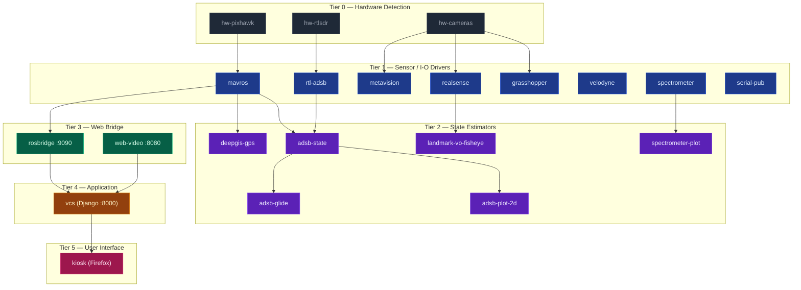

# Earth Rover Startup Scripts

> **Nothing auto-starts at boot.** Auto-enable was deliberately removed so
> every launch is an explicit operator decision (due-diligence per launch).
> The systemd unit files are still installed; they just sit idle until you
> ask for them via `make mission-up`, `systemctl --user start …`, or the
> Django mission console.

Two startup paths are supported:

1. **Mission target (recommended)** — declarative tier-based dependency graph
   in `mission.yaml`, compiled into a graph of `systemd --user` units that
   bring the stack up in topological order. Live status is exposed at
   `http://localhost:8000/mission/` once the UI layer is up.
2. **Legacy monolithic script** — `run_trike_stack.sh` launches every service
   in sequence with `nohup`. Still here for ad-hoc / interactive use.

## Mission Launch Dependency Chart



Edit `mission.yaml` to add/remove/reorder services; then re-run
`install_user_units.sh` to regenerate the unit graph.

## Directory Structure

```
scripts/startup/
├── mission.yaml                 # Declarative mission topology (source of truth)
├── install_user_units.sh        # Generate ~/.config/systemd/user/er-*.service
├── install_user_units.py        # Python helper that emits unit files
├── earth-rover-kiosk.desktop    # XDG autostart entry for the kiosk
├── firefox_kiosk.sh             # Wait-for-VCS + launch Firefox in --kiosk
├── vcs_up.sh                    # Bring up rosbridge + web_video + Django (no systemd)
├── vcs_down.sh                  # Stop the VCS triplet
├── vcs_status.sh                # Show VCS triplet status
├── vcs.tmuxp.yaml               # Optional: tmuxp session profile for the triplet
├── install.sh                   # Legacy: install ros-trike.service
├── ros_startup.sh               # Legacy startup router
├── run_trike_stack.sh           # Legacy: nohup every service inline
├── run_minimal_stack.sh         # Legacy minimal-stack launcher
├── stop_trike_stack.sh          # Legacy graceful shutdown
├── check_status.sh              # Legacy status check
├── ros-trike.service            # Legacy systemd user unit (entire stack as one)
├── ros-trike.desktop            # Legacy desktop autostart
└── README.md                    # This file

scripts/logs/                    # Log files (created automatically)
```

## Quick Start (Mission target — manual launch)

```bash
# 1. Generate ~/.config/systemd/user/er-*.service from mission.yaml.
#    This installs the unit files but does NOT enable or start anything.
cd /home/jdas/earth-rover/scripts/startup
./install_user_units.sh

# 2. Bring up just the web-frontend layer first so the mission console is
#    available as a launch panel (rosbridge + web_video + Django + kiosk):
make -C /home/jdas/earth-rover ui-up
xdg-open http://localhost:8000/mission/

# 3. From the console (or the CLI) start whichever services you want, e.g.:
systemctl --user start er-mavros.service
systemctl --user start er-grasshopper.service
systemctl --user start er-rtl-adsb.service er-adsb-state.service

# 4. Bring everything up at once when ready:
make -C /home/jdas/earth-rover mission-up
make -C /home/jdas/earth-rover mission-status

# 5. Bring everything back down:
make -C /home/jdas/earth-rover mission-down
```

To survive logout (headless rover) so manually-started services keep running:

```bash
loginctl enable-linger $USER
```

### One-shot SSD → NAS archive rsync

The boot+5min / daily-03:00 timer was disabled. Trigger archives explicitly:

```bash
make -C /home/jdas/earth-rover archive-now      # fire and forget
make -C /home/jdas/earth-rover archive-tail     # follow the log
make -C /home/jdas/earth-rover archive-cancel   # stop a running archive
```

### Re-enable auto-start (only if you really want the old behavior back)

```bash
systemctl --user enable --now er-mission.target            # whole graph at login
systemctl --user enable      er-kiosk.service              # kiosk on graphical login
systemctl --user enable --now er-rsync-archive.timer       # boot+5min and daily 03:00
```

You probably don't want the third one — only re-enable the timer if you
trust the SSD has enough free space at every boot.

## Legacy Quick Start

```bash
cd /home/jdas/earth-rover/scripts/startup
./install.sh
```

This will:
- Make all scripts executable
- Install systemd service to `~/.config/systemd/user/`
- Install desktop autostart file to `~/.config/autostart/`
- Create log directory

### 2. Choose Startup Method

#### Option A: Auto-start on Login (Desktop)
Already configured by `install.sh`. The stack will auto-start when you log in to the graphical session.

#### Option B: Auto-start via Systemd (Optional)
```bash
systemctl --user enable ros-trike.service
systemctl --user start ros-trike.service
```

#### Option C: Manual Start
```bash
./ros_startup.sh [target]
```

## Available Targets

### `trike` (Default - Full Stack)
Launches all services:
- MAVROS (Pixhawk connection)
- Serial data publisher
- Grasshopper3 stereo cameras
- RealSense camera
- Spectrometer data publisher
- Velodyne VLP-16 LiDAR
- ROSBridge WebSocket server
- Web video server
- DeepGIS GPS publisher
- Vehicle Control Station web server

**Usage:**
```bash
./ros_startup.sh trike
# or with delay
ROS_STARTUP_DELAY=15 ./ros_startup.sh trike
```

### `minimal` (Essential Services Only)
Launches minimal stack:
- MAVROS (Pixhawk)
- ROSBridge WebSocket
- Vehicle Control Station web server

**Usage:**
```bash
./ros_startup.sh minimal
```

### `full_system` (ROS Launch File)
Uses the ROS 2 launch file for:
- MAVROS + Vehicle Interface
- DeepGIS telemetry publisher

**Usage:**
```bash
./ros_startup.sh full_system
# or with custom parameters
./ros_startup.sh full_system fcu_url:=/dev/ttyUSB0:57600
```

### `vehicle_interface` (MAVROS Only)
Launches only MAVROS and vehicle interface node.

**Usage:**
```bash
./ros_startup.sh vehicle_interface
```

## Environment Variables

- `ROS_DISTRO` - ROS 2 distribution (default: humble)
- `ROS_STARTUP_DELAY` - Seconds to wait before starting (default: 0, recommended: 15)
- `EARTH_ROVER_HOME` - Path to earth-rover directory (default: /home/jdas/earth-rover)

## Managing Services

### Start Services
```bash
# Full stack
/home/jdas/earth-rover/scripts/startup/ros_startup.sh trike

# Minimal stack
/home/jdas/earth-rover/scripts/startup/ros_startup.sh minimal
```

### Stop Services
```bash
/home/jdas/earth-rover/scripts/startup/stop_trike_stack.sh
```

### View Logs
```bash
# List all logs
ls -lh /home/jdas/earth-rover/scripts/logs/

# Tail a specific log
tail -f /home/jdas/earth-rover/scripts/logs/mavros_px4.log

# View Django VCS log
tail -f /home/jdas/earth-rover/scripts/logs/django_vcs.log
```

### Check Systemd Service Status
```bash
systemctl --user status ros-trike.service
systemctl --user stop ros-trike.service
systemctl --user start ros-trike.service
systemctl --user restart ros-trike.service
```

## Log Files

All logs are written to: `/home/jdas/earth-rover/scripts/logs/`

Log files:
- `mavros_px4.log` - MAVROS flight controller connection
- `rosbridge.log` - ROSBridge WebSocket server
- `django_vcs.log` - Vehicle Control Station web server
- `web_video_server.log` - Camera streaming server
- `velodyne.log` - Velodyne LiDAR
- `realsense.log` - RealSense camera
- `grasshopper_stereo.log` - Grasshopper stereo cameras
- `spectrometer.log` - Spectrometer data publisher
- `ros_publish_serial.log` - Serial data publisher
- `deepgis_gps.log` - DeepGIS GPS publisher

## Troubleshooting

### Services won't start
1. Check USB devices are connected:
   ```bash
   ls /dev/serial/by-id/
   ```

2. Increase startup delay:
   ```bash
   ROS_STARTUP_DELAY=30 ./ros_startup.sh trike
   ```

3. Check ROS environment:
   ```bash
   source /opt/ros/humble/setup.bash
   source /home/jdas/ros2_ws/install/setup.bash
   ros2 node list
   ```

### Check individual service logs
```bash
# Check which services are running
pgrep -af "mavros|rosbridge|manage.py"

# View specific log
tail -f /home/jdas/earth-rover/scripts/logs/mavros_px4.log
```

### Pixhawk not connecting
```bash
# Use helper script to auto-detect Pixhawk
/home/jdas/earth-rover/scripts/connect_pixhawk.sh
```

### Web interface not accessible
1. Check Django is running:
   ```bash
   pgrep -f "manage.py runserver"
   tail -f /home/jdas/earth-rover/scripts/logs/django_vcs.log
   ```

2. Check ROSBridge is running:
   ```bash
   pgrep -f rosbridge
   tail -f /home/jdas/earth-rover/scripts/logs/rosbridge.log
   ```

3. Access at: http://localhost:8000 or http://YOUR_IP:8000

## Migration from Old Scripts

If you have old startup scripts, you can disable them:

```bash
# Disable old systemd service
systemctl --user disable ros-trike.service
systemctl --user stop ros-trike.service

# Remove old autostart file
rm ~/.config/autostart/ros-trike.desktop

# Then run the new installation
cd /home/jdas/earth-rover/scripts/startup
./install.sh
```

## Customization

To customize the startup behavior, edit:
- `run_trike_stack.sh` - Modify services or add new ones
- `run_minimal_stack.sh` - Change minimal stack configuration
- `ros_startup.sh` - Add new targets or modify startup logic

## Support

For issues or questions:
- Check logs in `/home/jdas/earth-rover/scripts/logs/`
- Review ROS topics: `ros2 topic list`
- Check ROS nodes: `ros2 node list`
- Verify connections: `ros2 node info /mavros`

